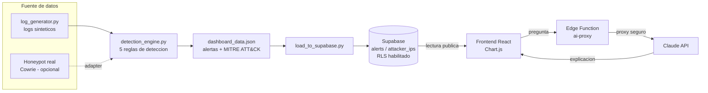

# 🛡️ SecureDash — Panel de Monitoreo de Seguridad

Panel de monitoreo estilo SOC (Security Operations Center) orientado a PYMEs
chilenas: ingesta logs de seguridad, aplica reglas de deteccion mapeadas al
framework **MITRE ATT&CK**, y muestra alertas priorizadas con un asistente IA
que las explica en lenguaje simple.

> **Estado del proyecto:** demo funcional con datos sinteticos. Ver la
> seccion [Datos: simulados vs reales](#-datos-simulados-vs-reales) para una
> explicacion honesta de que es real y que no, y la seccion
> [Roadmap](#-roadmap--proximos-pasos) para el camino a produccion.

---

## Por que este proyecto

La ciberseguridad en Chile esta en una etapa temprana: la mayoria de las
PYMEs no tiene presupuesto para un SOC real ni para herramientas como Splunk
o Wazuh, que cuestan miles de dolares al mes. Incidentes recientes (ej. el
ataque de ransomware a Banco Estado en 2023) muestran que la amenaza es real
incluso para organizaciones grandes.

SecureDash es un ejercicio para entender, de punta a punta, como funciona la
deteccion de amenazas: desde el log crudo hasta la alerta priorizada, pasando
por las reglas que un analista SOC junior usaria todos los dias.

---

## Arquitectura



La API key de Anthropic vive como secret en la Edge Function (servidor),
nunca en el bundle del frontend. Ver
[`docs/api-key-handling.md`](docs/api-key-handling.md) para el detalle y una
alternativa sin Supabase.

---

## El pipeline de deteccion

Esto es el corazon del proyecto: `pipeline/detection_engine.py` lee logs
(formato JSON Lines, uno por linea, igual a como los entregan shippers reales
como Filebeat) y aplica 5 reglas, cada una mapeada a una tecnica de
[MITRE ATT&CK](https://attack.mitre.org/):

| # | Regla | Logica | Umbral | Tecnica MITRE |
|---|-------|--------|--------|---------------|
| 1 | Fuerza bruta | N intentos de login fallidos desde la misma IP en una ventana corta | 5 fallos / 60s | [T1110 - Brute Force](https://attack.mitre.org/techniques/T1110/) |
| 2 | Inyeccion SQL | Patrones de sintaxis SQL (`OR 1=1`, `UNION SELECT`, `--`, `DROP TABLE`) en peticiones HTTP | regex sobre path/query | [T1190 - Exploit Public-Facing Application](https://attack.mitre.org/techniques/T1190/) |
| 3 | Escaneo de puertos | Una IP conecta a muchos puertos distintos en poco tiempo | 50 puertos / 60s | [T1595.001 - Scanning IP Blocks](https://attack.mitre.org/techniques/T1595/001/) |
| 4 | Credential stuffing | Una IP prueba varios usuarios distintos y finalmente logra acceso | 3+ usuarios fallidos + 1 exito | [T1110.004 - Credential Stuffing](https://attack.mitre.org/techniques/T1110/004/) |
| 5 | Acceso fuera de horario | Login exitoso de una cuenta legitima en horario anomalo | fuera de horario laboral simulado | [T1078 - Valid Accounts](https://attack.mitre.org/techniques/T1078/) |

Cada regla esta documentada en el codigo con su justificacion de seguridad
(por que ese patron indica un ataque, no solo "como" detectarlo).

La salida (`pipeline/output/dashboard_data.json`) tiene la forma exacta que
consume el frontend: alertas priorizadas, resumen por IP, distribucion de
amenazas y series para el grafico horario.

---

## 📊 Datos: simulados vs reales

Honestidad ante todo, porque es lo primero que pregunta cualquier revisor
tecnico:

**Lo que es simulado:**
- Los logs en `pipeline/data/*.jsonl` son generados por
  `pipeline/log_generator.py` con una semilla fija (reproducibles).
- Incluyen trafico "normal" (patron de oficina, concentrado en horario
  laboral) mas 5 ataques inyectados deliberadamente para que el motor de
  deteccion tenga algo que encontrar.
- Las IPs atacantes usadas corresponden a rangos que en reportes publicos de
  threat intelligence aparecen frecuentemente asociados a abuso (ej. nodos
  de salida Tor), elegidas para que el dataset se vea realista - pero los
  eventos especificos son ficticios.
- La geolocalizacion usa un mapeo local fijo (`GEO_LOOKUP` en
  `detection_engine.py`).

**Lo que es real:**
- Las 5 reglas de deteccion implementan logica real usada en SOCs (ventanas
  deslizantes, deteccion de patrones, correlacion de eventos).
- El mapeo a MITRE ATT&CK usa tecnicas e IDs reales del framework.
- El esquema de Supabase y el manejo de RLS / service_role siguen practicas
  reales de seguridad de datos.

**Como pasar a datos reales:**
1. Desplegar un honeypot (ver [`docs/honeypot-setup.md`](docs/honeypot-setup.md))
   y generar logs reales de ataques de internet en horas.
2. Reemplazar la geolocalizacion local por una API real
   ([ip-api.com](https://ip-api.com), gratis para bajo volumen).
3. Conectar feeds de threat intelligence (AbuseIPDB, AlienVault OTX) para
   enriquecer las alertas con reputacion real de IPs.

---

## Stack tecnologico

| Capa | Tecnologia |
|------|-----------|
| Generacion y deteccion | Python 3 (sin dependencias pesadas; `requests` solo para el loader de Supabase) |
| Persistencia | Supabase (Postgres + RLS + Realtime) |
| Frontend | React 19 + Vite + Chart.js (`react-chartjs-2`) |
| IA | Claude API (Anthropic), via Supabase Edge Function como proxy (o BYOK) |
| Deploy | GitHub Pages (frontend, via GitHub Actions) + Supabase (backend gestionado) |

---

## Como correrlo

### 1. Generar datos y alertas

```bash
cd pipeline
pip install -r requirements.txt --break-system-packages
python3 log_generator.py      # genera pipeline/data/*.jsonl
python3 detection_engine.py   # genera pipeline/output/dashboard_data.json
```

### 2. Frontend (modo estatico, sin Supabase)

El frontend ya viene con una copia de `dashboard_data.json` en
`frontend/src/data/`. Para verlo:

```bash
cd frontend
npm install
npm run dev
```

Para refrescar el dashboard con una nueva corrida del pipeline:

```bash
cp pipeline/output/dashboard_data.json frontend/src/data/
```

El asistente IA mostrara instrucciones de configuracion hasta que conectes
la Opcion A o B de `docs/api-key-handling.md`. Ver
[`frontend/README.md`](frontend/README.md) para el detalle completo,
incluyendo deploy a GitHub Pages con GitHub Actions.

### 3. (Opcional) Cargar a Supabase

```bash
# Ejecuta supabase/schema.sql en el SQL Editor de tu proyecto Supabase primero
export SUPABASE_URL="https://xxxx.supabase.co"
export SUPABASE_SERVICE_ROLE_KEY="..."
python3 pipeline/load_to_supabase.py
```

### 4. (Opcional) Desplegar el proxy de IA

```bash
supabase functions deploy ai-proxy
supabase secrets set ANTHROPIC_API_KEY=sk-ant-...
```

Luego configura `VITE_SUPABASE_URL` y `VITE_SUPABASE_ANON_KEY` en
`frontend/.env.local` (ver `frontend/.env.example`).

---

## Seguridad del proyecto

Puntos especificos que se revisaron deliberadamente, porque un proyecto de
ciberseguridad con fallas de seguridad obvias resta mas de lo que suma:

- **RLS habilitado** en todas las tablas de Supabase: lectura publica,
  escritura solo con `service_role` (ver `supabase/schema.sql`).
- **API key de Anthropic nunca en el frontend**: vive como secret de la Edge
  Function (ver `supabase/functions/ai-proxy/index.ts`).
- **Inputs sanitizados** en la Edge Function (limite de longitud en
  `question` y `alertsContext` antes de enviarlos al modelo).
- **Sin localStorage/sessionStorage** para datos sensibles (ver alternativa
  BYOK en `docs/api-key-handling.md`).

---

## Roadmap / proximos pasos

- [x] Tests automatizados para cada regla de deteccion (`pipeline/tests/`, 29 tests con pytest)
- [x] Flujo de resolucion/triage de alertas en la UI (ver `AlertsPanel.jsx`)
- [ ] Honeypot real con Cowrie para reemplazar logs sinteticos
- [ ] Geolocalizacion real via ip-api.com
- [ ] Enriquecimiento con AbuseIPDB / AlienVault OTX
- [ ] Mas reglas de deteccion (XSS, exfiltracion de datos, beaconing C2)
- [ ] Dashboard de "alert fatigue" - metricas de falsos positivos
- [ ] Persistir el estado "resuelta" en Supabase (requiere autenticacion -
      la funcion `resolve_alert()` en `supabase/schema.sql` ya esta lista
      para esto; hoy el frontend la deja en memoria de sesion, ver nota en
      `AlertsPanel.jsx`)

---

## Tests

```bash
cd pipeline
pip install -r requirements.txt --break-system-packages
python3 -m pytest -v
```

29 tests cubren las 5 reglas de deteccion de forma aislada (eventos
sinteticos minimos, no dependen de `log_generator.py`) mas un test de
integracion que corre el pipeline completo end-to-end y valida la forma del
`dashboard_data.json` resultante - el mismo tipo de chequeo que hubiera
atrapado el bug real de nombres de columna que encontramos en
`load_to_supabase.py` durante el desarrollo. Corren automaticamente en cada
push via `.github/workflows/tests.yml`.

---

## Limitaciones conocidas

- El dataset sintetico es pequeno (~770 eventos / 24h); en un entorno real
  el volumen seria ordenes de magnitud mayor y requeriria procesamiento por
  lotes o streaming.
- Las reglas son deterministicas (basadas en umbrales fijos), no usan
  machine learning. Es una decision deliberada para que la logica sea
  explicable - un requisito real en SOCs, donde cada alerta debe poder
  justificarse.
- La regla de "acceso fuera de horario" genera falsos positivos legitimos
  (alguien que de verdad trabaja de madrugada). En un SOC real esto se
  ajustaria con una baseline por usuario, no un umbral global.

---

## Licencia

MIT. Este es un proyecto educativo / de portafolio - no esta pensado como
producto de seguridad listo para produccion sin las extensiones descritas en
el roadmap.
