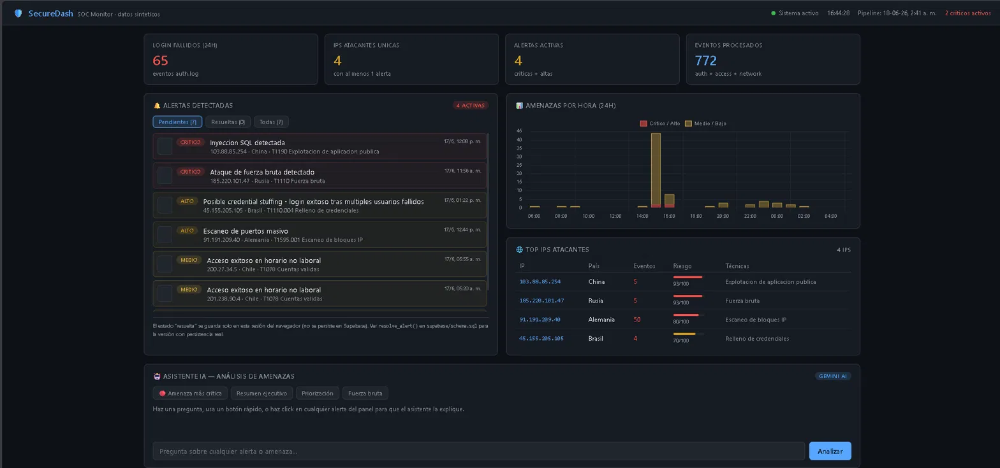
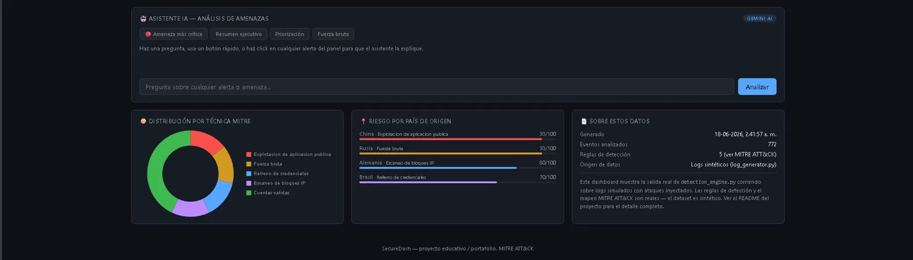

# 🛡️ SecureDash — Panel de Monitoreo de Seguridad en Tiempo Real

> **Demo en vivo:** [fabianix8-collab.github.io/securedash](https://fabianix8-collab.github.io/securedash/)

Panel de monitoreo estilo SOC (Security Operations Center) que detecta amenazas de seguridad, las mapea al framework **MITRE ATT&CK**, y las explica en lenguaje simple mediante un asistente IA. Construido para demostrar conocimiento real del ciclo completo de detección de amenazas: desde el log crudo hasta la alerta priorizada en pantalla.

---

## ¿Qué hace?

- **Detecta 5 tipos de ataque** usando reglas con lógica real de SOC: fuerza bruta SSH, inyección SQL, escaneo de puertos, credential stuffing y acceso anómalo fuera de horario
- **Mapea cada alerta a MITRE ATT&CK** (T1110, T1190, T1595.001, T1110.004, T1078) con links directos al framework
- **Prioriza alertas** por severidad (Crítico / Alto / Medio / Bajo) con filtros de triage y flujo de resolución
- **Explica amenazas en lenguaje simple** mediante un asistente IA (Gemini) integrado como proxy seguro vía Supabase Edge Function — la API key nunca queda expuesta en el frontend
- **Visualiza patrones** con gráficos de amenazas por hora, distribución por técnica MITRE y ranking de IPs atacantes por risk score normalizado
- **Despliega automáticamente** con GitHub Actions en cada push a `main`

---

## Demo

**[→ Ver dashboard en vivo](https://fabianix8-collab.github.io/securedash/)**

El asistente IA responde preguntas sobre cualquier alerta. Haz click en una alerta del panel para que la explique, o usa los botones rápidos:

- 🔴 Amenaza más crítica
- Resumen ejecutivo
- Priorización por impacto
- Explicación de fuerza bruta

---

## Screenshots





---

## Arquitectura

```
logs (JSON Lines)
      │
      ▼
detection_engine.py  ──►  dashboard_data.json
(5 reglas MITRE ATT&CK)         │
      │                          ▼
      ▼                   Frontend React
load_to_supabase.py  ──►  (Chart.js + Vite)
      │                          │
      ▼                          ▼
Supabase (Postgres)       Edge Function ai-proxy
+ RLS habilitado          (Gemini API, key en servidor)
```

**Decisiones de seguridad deliberadas:**
- RLS en todas las tablas: lectura pública, escritura solo con `service_role` (nunca el `anon key`)
- API key de Gemini en el servidor (Supabase secrets), nunca en el bundle del navegador
- Inputs sanitizados en la Edge Function antes de enviarlos al modelo
- Sin `localStorage` para datos sensibles

---

## Pipeline de detección

El corazón del proyecto es `pipeline/detection_engine.py`. Lee logs en formato JSON Lines (el mismo que usan shippers reales como Filebeat/Fluentd) y aplica 5 reglas:

| # | Regla | Lógica | Umbral | MITRE |
|---|-------|--------|--------|-------|
| 1 | Fuerza bruta | N fallos de login desde misma IP en ventana corta | 5 fallos / 60s | [T1110](https://attack.mitre.org/techniques/T1110/) |
| 2 | Inyección SQL | Patrones SQL en requests HTTP (`OR 1=1`, `UNION SELECT`, `--`) | regex sobre path/query | [T1190](https://attack.mitre.org/techniques/T1190/) |
| 3 | Escaneo de puertos | Una IP conecta a muchos puertos distintos en poco tiempo | 50 puertos / 60s | [T1595.001](https://attack.mitre.org/techniques/T1595/001/) |
| 4 | Credential stuffing | IP prueba múltiples usuarios distintos y logra acceso | 3+ usuarios fallidos + éxito | [T1110.004](https://attack.mitre.org/techniques/T1110/004/) |
| 5 | Acceso fuera de horario | Login exitoso de cuenta legítima en horario anómalo | fuera de horario laboral | [T1078](https://attack.mitre.org/techniques/T1078/) |

Cada regla está documentada con la justificación de seguridad: por qué ese patrón indica un ataque, no solo cómo detectarlo.

---

## Stack

| Capa | Tecnología |
|------|-----------|
| Detección | Python 3.11 — `detection_engine.py` con 5 reglas + `log_generator.py` |
| Tests | pytest — 29 tests (unitarios por regla + integración end-to-end) |
| Base de datos | Supabase (Postgres + RLS + Realtime) |
| Frontend | React 19 + Vite + Chart.js (`react-chartjs-2`) |
| Asistente IA | Gemini 2.5 Flash vía Supabase Edge Function (proxy seguro) |
| CI/CD | GitHub Actions — tests automáticos + deploy a GitHub Pages |

---

## Tests

```bash
cd pipeline
pip install -r requirements.txt
python3 -m pytest -v
```

29 tests cubren las 5 reglas de detección de forma aislada — cada test construye eventos sintéticos mínimos y verifica tanto el caso positivo (regla dispara) como el negativo (no dispara por debajo del umbral). Más un test de integración que corre el pipeline completo y valida la forma exacta del `dashboard_data.json`.

Los tests corren automáticamente en cada push vía `.github/workflows/tests.yml`.

> **Mantenimiento:** dependencias de `pipeline/requirements.txt` auditadas y actualizadas para resolver CVEs conocidos en `requests` y `pytest` — auditoría realizada con [GitScan](https://github.com/fabianix8-collab/gitscan), otra herramienta de este portafolio.

---

## Correr localmente

```bash
# 1. Pipeline de detección
cd pipeline
pip install -r requirements.txt
python3 log_generator.py
python3 detection_engine.py
cp output/dashboard_data.json ../frontend/src/data/

# 2. Frontend
cd ../frontend
npm install
npm run dev
# → http://localhost:5173/securedash/
```

Para el asistente IA local, configura `frontend/.env.local` (ver `frontend/.env.example`).

---

## Datos: simulados vs reales

Los logs son generados por `log_generator.py` con una semilla fija (reproducibles). Incluyen tráfico "normal" más 5 ataques inyectados deliberadamente para que el motor de detección tenga patrones que encontrar.

**Lo que es real:** las reglas de detección, la lógica de ventana deslizante, el mapeo MITRE ATT&CK, y el esquema de seguridad de Supabase.

**Cómo pasar a datos reales:** desplegar un honeypot con [Cowrie](https://cowrie.readthedocs.io/) — en horas tendrás ataques reales de internet contra tu servidor. Ver [`docs/honeypot-setup.md`](docs/honeypot-setup.md).

---

## Roadmap

- [x] 5 reglas de detección mapeadas a MITRE ATT&CK
- [x] 29 tests automatizados (pytest)
- [x] Asistente IA con proxy seguro (Gemini vía Supabase Edge Function)
- [x] Flujo de triage y resolución de alertas en la UI
- [x] CI/CD con GitHub Actions
- [x] Deploy en GitHub Pages
- [ ] Honeypot real con Cowrie
- [ ] Geolocalización real vía ip-api.com
- [ ] Enriquecimiento con AbuseIPDB / AlienVault OTX
- [ ] Más reglas: XSS, exfiltración de datos, beaconing C2
- [ ] Persistencia del triage en Supabase (función `resolve_alert()` ya implementada en el schema, requiere autenticación)

---

## Contexto

La mayoría de las PYMEs chilenas no tiene presupuesto para herramientas SOC reales como Splunk o Wazuh. Este proyecto es un ejercicio práctico para entender el ciclo completo de detección de amenazas — pipeline de datos, reglas de detección, visualización y explicación asistida por IA — usando solo herramientas gratuitas o de bajo costo.

---

## Licencia

MIT — proyecto educativo / portafolio.
